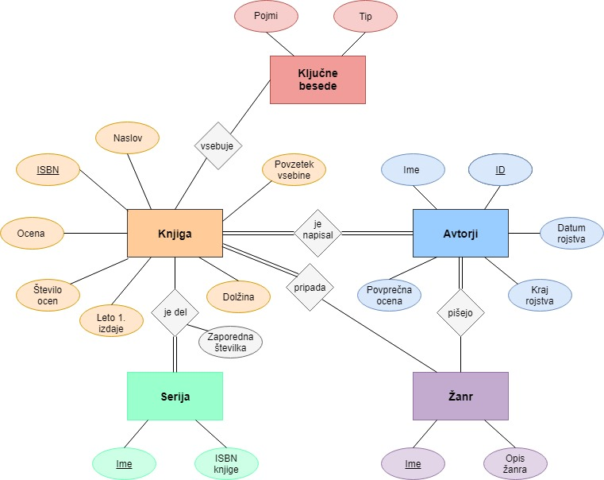

# Poišči pravo magično knjigo zase

Večina ljudi se počuti izgubljene, ko prebere zadnjo knjigo Harry Potter-ja. Kot da bi izgubili magični svet v katerem so živeli tako dolgo. Zato sva se odločili izdelati bazo knjig s pomočjo katerih lahko pobegneš v podoben magični svet. Podatke sva zbrali na spletni strani [Goodreads](https://www.goodreads.com/list/show/559.What_To_Read_After_Harry_Potter) in jih uredili v Pythonu.

Iz seznama ključnih besed izbereš o katerih pojmih želiš prebrat več, kako dolgo knjigo si pripravljen brati, ali želiš da je del zbirke ipd. ter tako izveš katera knjiga je najbolj primerna za tvoje trenutno postharryevsko razpoloženje.
Če tudi sam želiš obiskovati Bradavičarko, se lahko registriraš in tako urejaš svoj seznam knjig.
